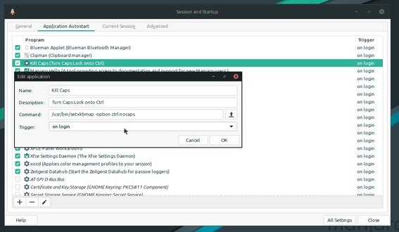
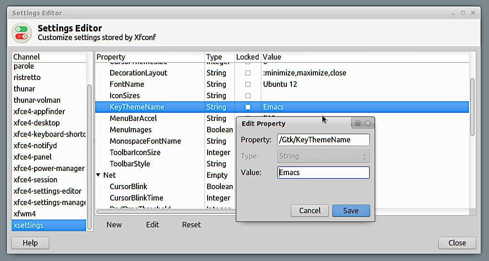

# Keyboard Settings

## Make the CapsLock key work as another Ctrl key

Edit the file ``/etc/default/keyboard``:  

        XKBMODEL="pc105"
        XKBLAYOUT="us"
        XKBVARIANT="alt-intl
        XKBOPTIONS="ctrl:nocaps" # Some people prefer "ctrl:swapcaps"

In order for the changes to take effect (on X Window) without rebooting:

``setxkbmap -option ctrl:nocaps``

Another option, on XFCE, would be to add an entry on:

Settings > Session and Startup > Application Autostart > Add Application

Name it whatever you like, same for the description, but be sure to set the command to be:

``/usr/bin/setxkbmap -option ctrl:nocaps``

Also, make sure the trigger is set to: **On Login**.

## Set the Page Back & Page Forward as PgUp & PgDown buttons

The "old" Thinkpad keyboards has a Page Back and Page Forward buttons right by the arrow keys.  
I find those unbearable annoying and prone to cause disasters. 
Issuing the following, as root or via sudo, turns those keys onto a Page Up and Page Down buttons:  

``setkeycodes e049 159 e051 158 e069 109 e06a 104``

Add the following entry onto root's crontab so it is executed everytime the box reboots, to avoid having to type it every time:  

``@reboot /usr/bin/setkeycodes e049 159 e051 158 e069 109 e06a 104``

This works for the keyboards of Thinkpads like the T43, T60, X220, T410, T420.

## Emacs Keybinds on XFCE

Launch XFCE's **"Settings Edditor"**.  
Select  the Channel **"xsettings"** and then the Property **"KeyThemeName"**.  
Add the value to the string **"Emacs"** (without quotes).  
That's it you are done.

If the Property isn't there, simply create a new one (be sure to be on the right Channel).  
Use "String" as Type, just like in the screenshot below:

*Caveat Emptor*:  
Be aware that not all of Emacs keybinds will work and certainly the ones that will work won't work on the whole system, but it is nice to be able to type Ctrl + E and Ctrl + A now and then to go there fast.

